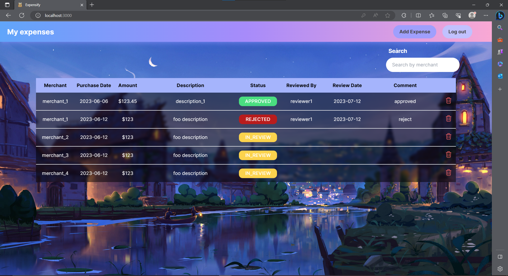

# Expensify

# Table of Contents
- [Introduction](#introduction)
- [Features](#features)
- [Technologies](#technologies)

## Introduction
Expensify is a web app for employee and reviewer to manage expenses. If user login as an employee, they can view all their expenses, add a new expense or delete expenses that haven't been reviewed. If user login as a reviewer, they can view all employees' expenses and approve or reject them. 

## Feature
### Basic authentication

### Employee can add or delete expense

### Both employee and reviewer can search for expenses by merchant name

### Reviewer can approve or reject an expense

## Technology
### Front-end Technologies
Next.js 13.4.7   
Tailwind CSS 3.3.2  
TypeScript 5.1.3   

### Back-end Technologies
Spring boot 3.1.0    
Spring security 3.1.0

### Database Technology
PostgreSQL